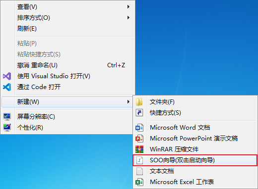
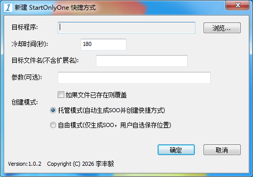
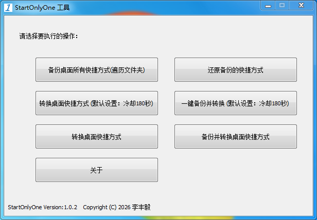

# StartOnlyOne
[](LICENSE)
[]()
[]()


Windows 下的一款防重复启动工具，将任何程序的快捷方式转换为受管理的启动器，支持冷却时间、备份还原、任务栏托管。

## 功能特性
- 将任意 `.exe` 转换为托管快捷方式，自动防重复启动
- 可自定义冷却时间（秒），不同设置生成独立配置文件
- 一键备份桌面（含公共桌面）和任务栏上的快捷方式
- 一键还原备份，支持按时间选择恢复点
- 快捷方式图标保持原程序图标，体验无缝

## 快速开始
1. 从 [Releases](https://github.com/lfy090926/StartOnlyOne/releases) 下载最新 `StartOnlyOne.exe`
2. 首次运行会自动注册右键“新建”菜单
3. 在桌面空白处右键 → 新建 → **SOO向导(双击启动向导)**
    
4. 双击打开向导文件(如图)

    

5. 选择目标程序，设置冷却时间，填写目标文件名，选择创建模式，点击确定
    
    >目标文件名为快捷方式或SOO文件名，默认自动填写目标程序名
    
    >托管模式创建快捷方式，自由模式创建SOO文件
6. 桌面出现同名快捷方式，多次尝试双击即可体验防重复效果
7. 直接运行`StartOnlyOne.exe`可以使用批量转换功能,包括当前用户的桌面和公共桌面以及任务栏上的快捷方式。
    

## 编译（从源码）
### 环境要求
- Visual Studio 2022 (C++ 桌面开发)
- Windows SDK 10.0
- [jsoncpp](https://github.com/open-source-parsers/jsoncpp) 库（需要自己配置环境）

### 步骤
```bash
git clone https://github.com/lfy090926/StartOnlyOne.git
cd StartOnlyOne
# 用 VS 打开 StartOnlyOne.sln
# 设置 Release 配置，生成解决方案
```
> 1.1.1版本后支持makefile，使用make命令编译
> ```bash
> # makefile需要配置VC环境变量和jsoncpp库路径
> make
> ```
## 常见问题
- **Q:为什么程序需要管理员权限?**

  A:公共桌面路径（C:\Users\Public\Desktop）通常需要管理员权限才能写入。


本软件使用了 [jsoncpp](https://github.com/open-source-parsers/jsoncpp) 库，其版权归原作者所有，许可证见 [licenses/jsoncpp-license.txt](licenses/jsoncpp-license.txt)。

# 
本软件的开发者是目前是一名高中生，正在学习编程和软件开发，希望这个工具能帮助到大家。如果有任何问题或建议，欢迎在 GitHub 上提 issue 和 PR。如果您愿意的话，也可以考虑[捐赠](docs/donate.md)一些零钱支持我的学习和开发。谢谢大家！

> 项目中存在一些AI代码，但都经过了人工审核和修改,包括README.md的部分内容、项目里的部分C++代码和注释、以及.rc资源文件部分内容。
